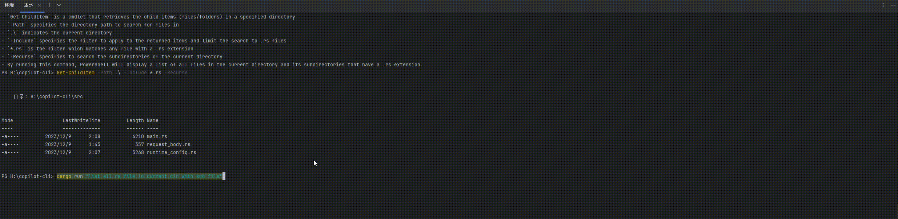

# Copilot Cli

[中文文档看这里](./docs/README_zh.md)

> Copilot for Command Line Interface by OpenAI.

A command line tool that can help you generate commands by OpenAI's GPT model.

# Usage

```bash
cargo run "list all rs files in current directory"
```

or

```bash
# if you have installed it, you can use copilot-cli directly
# maybe you need to add it to your PATH
copilot-cli "list all rs files in current directory"
```

When first run, it will create a `.copilot_cli_config.json` config file in your home directory. You need to fill in your OpenAI API key in it.

```json
{
  "openai_token": "your openai token"
}
```

You can apply for an OpenAI API key [here](https://platform.openai.com/api-keys).

Chinese users can use [通义千问](https://help.aliyun.com/zh/dashscope/developer-reference/activate-dashscope-and-create-an-api-key).

You can modify the config file to change the default settings. More info you can see [here](src/runtime_config.rs).

## set alias

You can set alias for `copilot-cli` to make it easier to use.

In `bash` (Mac or Linux):

```bash
# open your bashrc file
nano ~/.bashrc
# add this line to the end of the file
alias ??="copilot-cli"
# save and exit

# execute this command to make it work
source ~/.bashrc
# then you can use copilot-cli by typing ??
```

In `PowerShell` (Windows):

```powershell
# open your PowerShell profile file
notepad $PROFILE
# add this line to the end of the file
Set-Alias -Name ?? -Value copilot-cli
# save and exit
```

# Enjoying



# Why This Project

The inspiration for this project comes from Microsoft's [Copilot for CLI](https://githubnext.com/projects/copilot-cli/). Why don't I just use Microsoft's version? Because I haven't been able to obtain beta access to it.